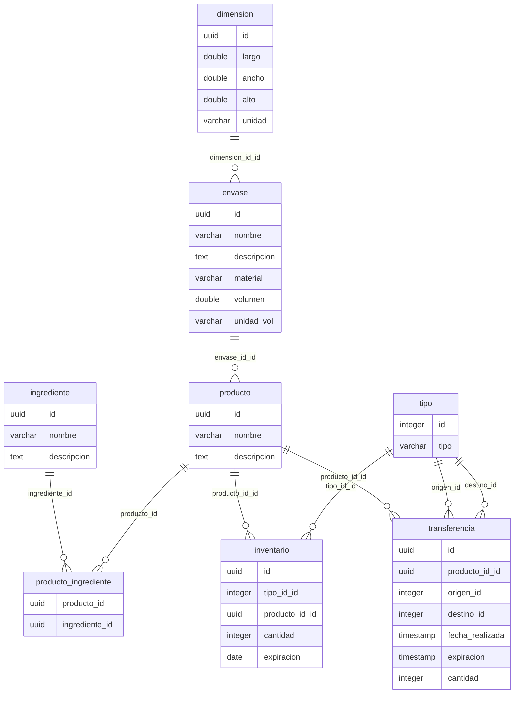

# Guía de Configuración y Ejecución para Drugstore Backend
## Prerrequisitos
- Docker y Docker Compose instalados.
- PHP 8.2 o superior.
- Composer para la gestión de dependencias de PHP.

## Configuración
1. Clonar el Repositorio:
```bash
git clone https://github.com/lacadaemon94/drugstore-backend.git
cd drugstore-backend
composer install
```
2. Construir el docker
```bash
docker-compose build
```
3. Iniciar los contenedores Docker (sera servida en localhost:8080).
```bash
docker-compose up
```
4. Accesar a la terminal de la App de Symfony.
```bash
docker exec -it symfony_app bash
```
5. Instalar el runtime de Symfony y dependencias de PHP
```bash
composer install
``` 
o solo:
```bash
composer require symfony/runtime
```
5. Crear Migracion:
```bash
php bin/console make:migration
``` 
6. Aplicar la Migracion:
```bash
php bin/console make:migration
``` 
7. Correr scripts de SQL para alimentar la BD (afuera del terminal de symfony_app) en el directorio raiz:
```bash
docker-compose exec -e PGPASSWORD='!ChangeMe!' postgres psql -U app -d app -f /var/www/sql_scripts/01_producto.sql
``` 
```bash
docker-compose exec -e PGPASSWORD='!ChangeMe!' postgres psql -U app -d app -f /var/www/sql_scripts/02_tipo.sql
``` 
```bash
docker-compose exec -e PGPASSWORD='!ChangeMe!' postgres psql -U app -d app -f /var/www/sql_scripts/03_inventario.sql
``` 

## Diagrama E-R

En el centro del modelo se encuentra la tabla "producto", que tiene relaciones con "envase" para describir su empaque y "ingrediente" para detallar sus componentes. Además, se gestiona el inventario de estos productos a través de la tabla "inventario", que también se relaciona con "tipo" para categorizar el tipo de inventario. Por último, se tiene la tabla "transferencia" que administra las transferencias de productos entre diferentes tipos de inventarios.
## Puntos clave del esquema de la base de datos:
- En el inventario el constraint entre `tipo_id_id`, `producto_id_id` y `expiracion` aseguran entradas unicas por `producto`, `expiracion` y `tipo`.
- La tabla `producto` es central y se relaciona con varias otras tablas.
- `dimension` describe las dimensiones físicas de un envase.
- `envase` detalla el tipo de empaque de un producto.
- `ingrediente` lista los componentes individuales de un producto.
- `inventario` gestiona la cantidad y expiración de productos en stock.
- `tipo` categoriza diferentes tipos de inventarios.
- `transferencia` administra el movimiento de productos entre diferentes inventarios.

**Resumen de Triggers y Funciones:**

1. **Actualizar cantidad si el producto ya existe**:
   - Antes de insertar en la tabla `inventario`, se verifica si ya existe una fila con el mismo `producto_id_id` y `expiracion`.
   - Si existe, se actualiza la `cantidad` de la fila existente sumando la nueva cantidad.
   - Si no existe, se permite la inserción.

2. **Manejo de inserciones en la tabla Transferencia**:
   - Al insertar en la tabla `transferencia`, se deduce la `cantidad` del `origen tipo_id_id`.
   - Si no se afectan filas durante la deducción, se previene la inserción.
   - Si la `cantidad` en el origen llega a 0, se elimina la entrada.
   - Se verifica si ya existe una entrada con el mismo `producto_id_id`, `expiracion`, y `destino tipo_id_id`.
     - Si existe, se agrega la `cantidad`.
     - Si no existe, se inserta una nueva entrada.

---

# Documentación API

## Tabla de Contenidos

- [CREAR_PRODUCTO]
- [EDITAR_PRODUCTO]
- [BORRAR_PRODUCTO]
- [LISTAR_PRODUCTOS]
- [AGREGAR_PRODUCTO_BODEGA]
- [TRANSFERIR_PRODUCTO_INVENTARIO]
- [LISTAR_INVENTARIO]

---

## CREAR_PRODUCTO

**URL**: `/producto/create`

**Method**: `POST`

**Description**: Crear producto con propiedades de envase y dimensiones.

### Request

**Body**:

```json
{
    "nombre": str,
    "descripcion": str,
    "envase": {
        "nombre": str,
        "descripcion": str,
        "material": str,
        "volumen": int,
        "unidadVol": "mL",
        "dimensiones": {
            "largo": int,
            "ancho": int,
            "alto": int,
            "unidad": "cm"
        }
    },
    "ingredientes": [
        {
            "nombre": str,
            "descripcion": str
        },
        {
            "nombre": str,
            "descripcion": str
        }
    ]
}
```

## EDITAR_PRODUCTO

**URL**: `/producto/edit`

**Method**: `POST`

**Description**: Endpoint para editar producto.

### Request

**Body**:

```json
{
    "id": uuid,
    "nombre": str,
    "descripcion": str,
    "precio": float,
    "expiracion": date,
    "envase": {
        "nombre": str,
        "descripcion": str,
        "material": str,
        "volumen": int,
        "unidadVol": "ml",
        "dimensiones": {
            "largo": int,
            "ancho": int,
            "alto": int,
            "unidad": "cm"
        }
    },
    "ingredientes": [
        {
            "nombre": str,
            "descripcion": str
        },
        {
            "nombre": str,
            "descripcion": str
        },
        {
            "nombre": str,
            "descripcion": str
        }
    ]
}
```

## BORRAR_PRODUCTO

**URL**: `/producto/delete/{id}`

**Method**: `DELETE`

**Description**: Borrar producto a traves de parametro `id`.

## LISTAR_PRODUCTOS

**URL**: `/producto/list`

**Method**: `GET`

**Description**: Listar todos los productos.

## AGREGAR_PRODUCTO_BODEGA

**URL**: `/bodega/add`

**Method**: `POST`

**Description**: Agregar un producto, con cantidad y fecha de expiracion definidos.

### Request

**Body**:

```json
{
    "tipo_id": int,
    "producto_id": uuid,
    "cantidad": int,
    "expiracion": date
}
```

## TRANSFERIR_PRODUCTO_INVENTARIO

**URL**: `/inventario/transfer`

**Method**: `POST`

**Description**: Transferir producto entre tipo de inventarios.

### Request

**Body**:

```json
{
    "producto_id": "1df04a0e-4575-4528-a4b9-46904576ce9a",
    "origen_tipo_id": 1,
    "destino_tipo_id": 2,
    "cantidad": 50,
    "fecha": "2023-08-18",
    "expiracion": "2025-10-21"
}

```

## LISTAR_INVENTARIO

**URL**: `/inventario/list`

**Method**: `GET`

**Description**: Listar todo el inventario.

---
## Notas
- Opte por no crear endpoints y la logica `CRUD` de envase e ingredientes por tiempo y por que no se solicitaban en el problema.
- Hay un problema con el formato de fechas que por cuestiones de tiempo no depure y provoca transferencias erroneas en el frontend.
- Opte por listar todo el inventario y luego ocupar el objeto en el frontend para propositos de filtracion.
